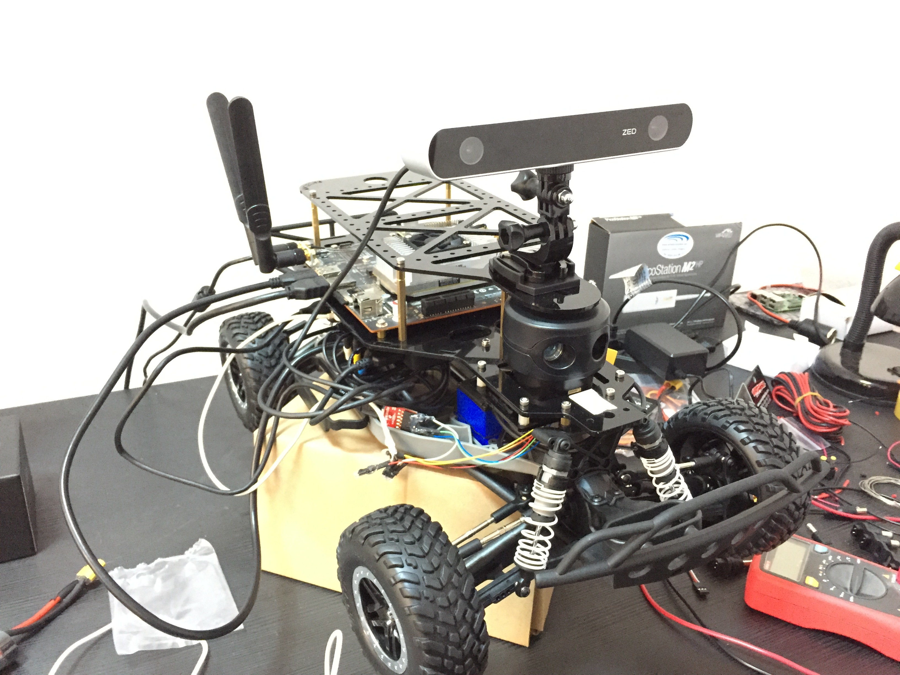

# Jetson-RaceCar-AI
Artificial intelligence for Jetson RaceCar 
Autonomous race car with deep learning.

### Race Car's Photo 

### Hardware
+ System: 
NVIDIA Jetson TX1 with Jetpack 3.0

+ Camera: 
[ZED Stereo Camera](https://www.stereolabs.com) ( [ZED SDK](https://www.stereolabs.com/developers/) )

+ Lidar: 
[Scanse Sweep](http://scanse.io) 
For more information look up Jim's blog post [JetsonHacks - Sweep Software Installing](http://www.jetsonhacks.com/2017/06/06/scanse-sweep-lidar-software-install/).

### Running Artificial Intelligence Command:
`python3 ai.py`

### Using Predict Command:
`python3 predict.py <ImageFilePath> <LidarData>`

### Model Training:
`python3 train.py`

### Using TensorBoard:
`tensorboard --logdir=Data/Checkpoints/./logs`

### Installing TensorFlow for Jetson TX1:
Look up my <b>[TensorFlow-For-Jetson-TX1](https://github.com/ardamavi/TensorFlow-For-Jetson-TX1)</b> repository.

### Important Notes:
- Used Python Version: 3.6
- Install necessary modules with `sudo pip3 install -r requirements.txt` command.
- Install [Sweeppy](https://github.com/scanse/sweep-sdk/tree/master/sweeppy)
- Install [OpenCV with CUDA for Jetson TX1](http://docs.opencv.org/3.2.0/d6/d15/tutorial_building_tegra_cuda.html)

#### In my internship at OpenZeka - NVIDIA DLI
